# Tokenização e Ranqueamento de Documentos

 
 
 

- <h2>Problema</h2>
  
 Como é de conhecimento de todos, as estruturas do tipo lista, pilha e filha formam a base
  da estrutura de dados e são amplamente utilizadas como parte de muitos problemas atuais.
  Sua função é adaptar tais estruturas para um problema de contagem de palavras em um texto.
  Como entrada, a aplicação receberá um conjunto de documentos D = {<i>d1, d2, . . . , dn</i>}, os
  quais devem ser processados via tokenização, onde, as palavras são extraída e armazenadas.
  Nesse processo, tem-se o que chamamos de stop words (vide, https://gist.github.com/
  alopes/5358189), que devem ser desconsideradas na avaliação. Por fim, utilize dos conceitos
  de TF/IDF (vide, https://rockcontent.com/br/blog/tf-idf/) para ranquear os documentos
  sob a importância de suas palavras. Considere textos em inglês para evitarmos erros com
  acentuação. Considere realizar esse problema a partir das seguintes fases:
  
    1- Realizar a tokenização dos documentos e separação das stop words.
    
    2- Aplicação do TF/IDF nas palavras encontradas seguindo sua base teórica.
    
    3- Utilizando uma entrada com algumas palavras, mostrar em ordem de importância os documentos avaliados. 

# Estrutura do Problema

- <h2>Estrutura utilizada</h2>

	

	Primeiramente, o motivo da escolha da Lista Dinâmica se deu ao fato de que era a estrutra mais conveniente a ser utilizada para este problema. A Fila não era a estrutura ideal por possibilidar a remoção de elementos somente no início e no final. A Pilha tem o mesmo problema, além de que o último elemento que entra sempre será o primeiro a ser removido. Logo, a Lista é a que oferece a maior gama de possibilidades dentre aquelas que são úteis para o desenvolvimento da solução.

	A lista dinâmica é uma variante do modelo estático [vide git](https://github.com/mpiress/linear_list). Assim, antes de apresentar as modificações existêntes nessa implementação, vejamos uma representação gráfica do modelo dinâmico em questão. Observe as nomenclaturas utilizadas na figura, essas são utilizadas na implementação fornecida, as quais podem estar definidas/parametrizadas no idioma inglês.
	

	

		 
	

	

	Note pela figura que, o primeiro bloco armazenado em RAM não apresenta o tipo dado como parte da estrutura, mas sim um valor 0 <b>"simbólico"</b>. Isso porque é preciso inserir na estrutura o que chamaremos de cabeça da lista. A cabeça de uma lista nada mais é que um ponteiro <i>vazio</i> (i.e., um tipo similar ao void) que indica qual posição de memória será utilizada como base/início da lista. 
	

	

	Uma outra nomenclatura a ser observada na figura é a existência de um ponteiro <b>prox</b>. Este tem por objetivo apontar para o próximo bloco de memória que conterá o novo dado ou para NULL, o que facilita a navegação entre os blocos e a identificação do fim da lista. Este ponteiro se mostra imprescindível, uma vez que abandonamos o modelo sequencial de memória e adotamos um conceito cujos blocos estão em endereços aleatórios. Nesse novo modelo, inserções, remoções, pesquisas e impressões da lista são apoiadas por dois outros ponteiros, o <b>primeiro</b> e o <b>último</b>, conforme representação da figura.
	

	> Qual a função dos ponteiros <b>primeiro</b> e <b>ultimo</b>?
	>
	> Como a lista é composta de blocos espalhados na memória, torna-se necessário identificar qual bloco representa a cabeça da lista. Para isso, é utilizado o ponteiro primeiro. Da mesma forma, identificar o último bloco também se torna importante, uma vez que, novas inserções são realizadas sempre no final dessa estrutura com o objetivo de facilitar sua manipulação.

	

	Se considerarmos um computador hipotético com 8Mb de RAM distribuídos em dois pentes de 4Mb cada, uma representação da lista dinâmica poderia ser compreendida da seguinte forma:
	

	

		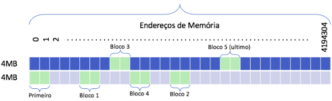 
	
 

	

	Dado o exemplo de distribuição da lista dinâmica em memória apresentado na figura acima, é possível notar que os procedimentos de tratamento dessa estrutura não são tão triviais quanto os utilizados pela vertente estática baseada em vetor. Em resumo, para coordenar essa nova estrutura, é preciso adotar no mínimo as seguintes funções:
	

	

	1. <b>FLVazia</b>: Função responsável por criar um espaço de memória para ser a <i>cabeça</i> da lista. Para tanto, é utilizado a chamada de função nativa do C/C++ <b>malloc</b>, o qual recebe como referência o espaço a ser reservado por meio da diretriz <b>sizeof</b>. Nesse primeiro momento, o <i>casting</i> (i.e., conversão de um tipo void criado pelo malloc para um tipo específico) se torna opcional, sendo utilizado na codificação apenas para manter um único padrão de definição de função. Como pode ser observado no código disponibilizado, o endereço produzido pela execução do malloc é copiado para o ponteiro primeiro e último, mantendo ambos no mesmo endereço. O que significará que a lista se encontra vazia. Por fim, apontamos o prox de ambos os ponteiros para NULL.
	

	

	2. <b>Inserir</b>: Para inserir elementos na lista, a primeira ação a ser realizada é reservar espaço em memória para esse novo dado. Para isso, o apontador último deve apontar em memória para o endereço do novo bloco cujo prox apontará para NULL.  
	

	>Dica para inserções:
	>
	>Quando a lista é criada (i.e., execução do FLVazia), os ponteiros estão apontando para a "cabeça da lista". Essa posição de memória não deve ser utilizada para armazenar dados. Então, para cada novo bloco a ser armazenado deve-se reservar uma nova área na memória. Esse procedimento é realizado pelo malloc e o local a ser guardado esse novo endereço é no ponteiro que representa o próximo (i.e., prox). Nesse contexto, os novos endereços que são criados sempre são recebidos pelo ponteiro prox do último bloco existente, ou seja, o que está referenciado pelo ponteiro de último. Veja um pequeno exemplo desse processo a partir da figura a seguir. 

	

		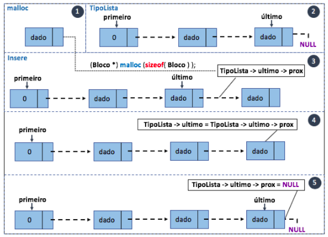 
	
 

	

	<b>Remover</b>: Para remover um bloco, primeiro é preciso testar se lista não está vazia, i.e., primeiro != último. Se estiverem apontando para o mesmo endereço, um erro é apresentado e a função finalizada. Caso contrário, é preciso pesquisar o bloco na lista antes de removê-lo. Para isso, é preciso utilizar um apontador auxiliar (i.e., aux) para receber o endereço da cabeça da lista. Uma vez que, a cabeça da lista não possui dado valido, é realizada a validação sempre utilizando a próxima posição e diferente de NULL. Note que no laço while dentro do código disponibilizado é realizado exatamente isso, avançando o ponteiro aux para o próximo, comparando o bloco encontrado com o dado a ser removido. Ao término do laço testa-se se a variável aux não é NULL, ou seja, não chegou ao final da lista sem achar o valor desejado. Se o dado foi localizado, ele estará no endereço de aux a partir de seu prox, então, para remover esse dado é preciso literalmente pula-lo na sequencia de ligações dos ponteiros. Para isso, cria-se uma segunda variável para receber o endereço de aux e avançamos a variável aux para a posição exata do dado a ser removido. Feito isso, o prox do novo ponteiro de apoio ao aux é ligado ao prox do bloco a ser removido e que está sendo apontado por aux. Por fim, libera-se a memória utilizando-se a função nativa free em aux. Veja a representação desse processo através do exemplo da figura abaixo. 
	

	

		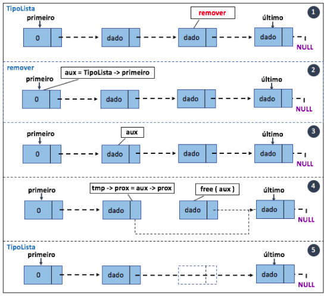 
	
 
	
	Nossa estrutura é um pouco diferente da estrutura convencional de listas dinâmicas, pois consiste em várias Listas Dinâmicas dentro de si mesmas. A partir do seguinte trecho de código é possível entender a organização:
	
	Vamos entender os passos do mais específico para o mais generalista. No arquivo "palavra.hpp", a <i>struct</i> "Word" armazena alguns dados sobre uma palavra específica, que são: a própria palavra numa <i>string</i>, a quantidades de vezes que a palavra apareceu num <i>short int</i>, o valor ASCII da palavra (resultado da soma do valor ASCII de cada caractere) num <i>short int</i>, a inicial da palavra num <i>char</i> e o resultado do cálculo de TF/IDF da palavra num <i>float</i>.
	
	

		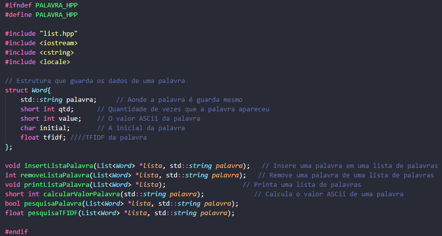 
	

	
	Já em "listPals.hpp", a <i>struct</i> "Palavras" possui uma lista de palavras de um certo tamanho, a quantidade de palavras e o tamanho em uma variável <i>int</i>.
	
	

		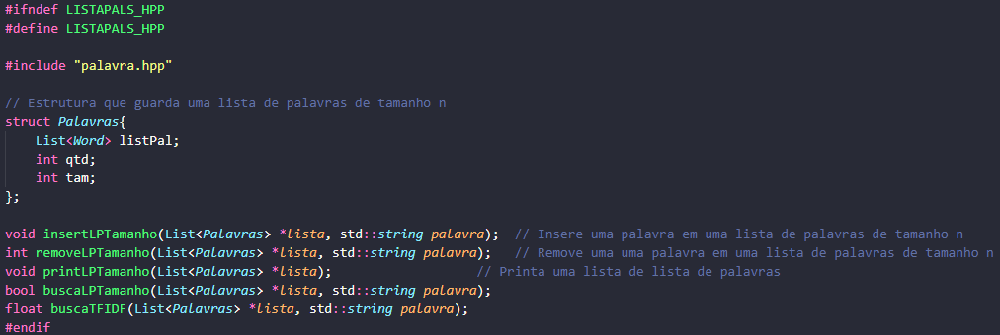 
	

	
	Além disso, "documento.hpp" possui uma <i>struct</i> chamada "Documento" com uma lista de listas de palavras dividido pelo tamanho delas. Cada lista armazena palavras de um certo tamanho. Por exemplo: a lista 1 armazena palavras de tamanho N, a lista 2 armazena palavras de tamanho N+1. Ademais, possui uma variável do tipo <i>string</i> para guardar o nome do documento, a quantidade de palavras no documento em um <i>int</i> e um <i>float</i> para guardar dados do TF/IDF futuramente.
	
	

		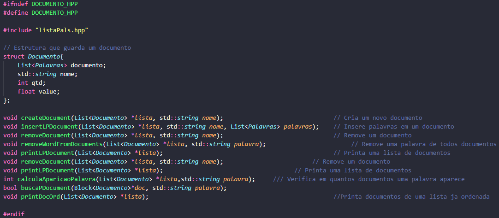 
	

- <h2>Método de remoção das stop words</h2>

	Através do método removeStopWords(), dois auxiliares são criados, sendo o primeiro que percorre cada lista de tamanho, e o segundo que percorre palavra por palavra desta lista. Assim, o método  removeWordFromDocuments() é chamado para remover as palavras do documento.
	
	As stop words da lista de tamanho 1 são comparadas a lista de tamanho 1 de todos os documentos. Esse processo é repetido para os tamanhos 2, 3, ..., n até que todas as listas de tamanho das stop words sejam percorridas e as palavras removidas dos documentos.

	

		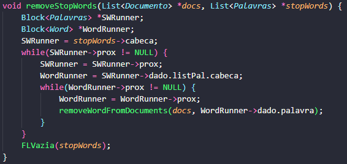 
	
 
	
	

		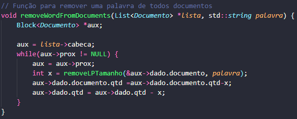 
	
 

- <h2>Método de busca</h2>

	- <h3>TF/IDF</h3>
		O TF/IDF é uma estatística que mede a importância de uma palavra em um corpo de texto quando comparada a uma coleção maior de outros documentos. Se uma palavra aparece muitas vezes em um documento, essa palavra se torna mais importante. Mas quando essa palavra também aparece com frequência em outros documentos, ela perde importância.

		TF/IDF significa Term Frequency Inverse Document Frequency. Ele é explicado com mais detalhes em um tópico separado abaixo

	- <h3>Ranqueamento</h3>
		O Ranqueamento é feito de tal forma a obter uma frase desejada do usuário, e procurar o valor do tfidf de cada palavra da frase em cada documento, obtendo assim o valor de cada documento para dada frase. A partir do valor obtido para cada documento utilizamos um bubble sort para ordenar os documentos de forma que o de maior valor fique em primeiro.
		
	

		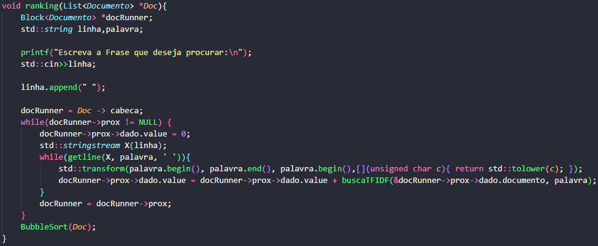 
	
 

- <h2>TF/IDF</h2>
	TF-IDF é um cálculo estatístico que mede a importância de uma palavra em um texto quando comparado com uma coleção maior de outros documentos. Se uma palavra aparece muitas vezes em um documento, a palavra se torna mais importante. Mas quando essa palavra também aparece frequentemente em outros documentos, ela perde importância.
	
	TF-IDF significa <i>Term Frequency – Inverse Document Frequency</i>. Essa expressão pode ser traduzida para o português como “Frequência do Termo – Frequência Inversa dos Documentos”.
	
	TF se refere à “frequência do termo”. Essa parte do cálculo responde à pergunta: com que frequência o termo aparece nesse documento? <b>Quanto maior for a frequência no documento, maior será a importância do termo.</b>

	Já o IDF significa “frequência inversa dos documentos”. Nessa parte, a ferramenta responde: com que frequência o termo aparece em todos os documentos da coleção? <b>Quanto maior for a frequência nos documentos, menor será a importância do termo.</b>

	O cálculo do IDF considera que termos que se repetem frequentemente nos textos — como artigos e conjunções (a, o, e, mas, que etc.) — não têm relevância para os documentos e, no caso do Google, para a indexação e o rankeamento.

	Então, quando o fator IDF é incorporado, o cálculo diminui o peso dos termos que ocorrem com muita frequência no conjunto de documentos e aumenta o peso dos termos que ocorrem raramente. Este esquema ajuda a entender melhor:
	
	

		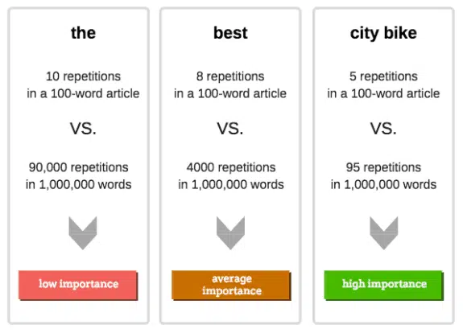 
	
 
	
	<h3>Limitações do TF/IDF</h3>

	- <h4>Palavras-chave e intenção</h4>
			Ao focar apenas nas primeiras páginas nos resultados de pesquisa, as ferramentas TF-IDF SEO (<i>Search Engine Optimization</i>) correm o risco 				de analisar páginas que não são realmente seus concorrentes. Eles também podem segmentar sites que operam em nichos diferentes do seu próprio site.
			Além disso, o conteúdo desses sites pode ser muito longo ou superficial demais para fornecer uma comparação útil com seu próprio conteúdo.
			
	- <h4>Limitações de tamanho da amostra</h4>
			O banco de dados do Google para TF-IDF consiste em todas as páginas da Internet que ele indexou. Nenhuma outra ferramenta de SEO tem acesso a 				esse banco de dados. Como resultado, o melhor que eles podem fazer é usar estimativas aproximadas, com precisão incerta.
			Na verdade, as ferramentas TF-IDF frequentemente examinam apenas as 10 ou 20 principais páginas dos resultados de pesquisa do Google.
			
	<h3>Implementação do TF-IDF no código</h3>
	
	- <h4>TF</h4>
		

			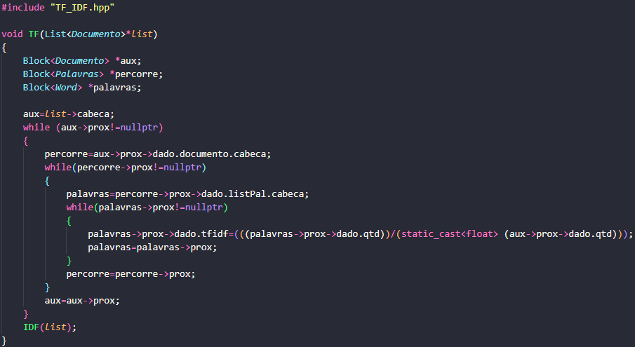 
		
 
		São criados blocos auxiliares das estruturas Documento (<i>aux</i>), Palavras (<i>percorre</i>) e Word (<i>palavras</i>). O método recebe a lista de documentos e aponta a variável <i>aux</i> para a cabeça dessa lista. Como a cabeça está vazia, o primeiro while percorre a lista enquanto <i>aux->prox</i> tiver um valor válido (diferente de null).
		Depois, a variável <i>percorre</i> recebe a cabeça da lista de palavras do documento. Como a cabeça está vazia, o segundo while percorre a lista enquanto <i>percorre->prox</i> tiver um valor válido (diferente de null).
		Posteriormente, a variável <i>palavras</i> recebe a cabeça da lista de palavras separadas por tamanho. Como a cabeça está vazia, o terceiro while percorre a lista enquanto <i>palavras->prox</i> tiver um valor válido (diferente de null). Neste terceiro while, é feito o cálculo do TF. 
		$$TF=\frac{número\:de\:ocorrências\:da\:palavra\:no\:documento}{número\:de\:palavras\:do\:documento}$$
		O número de ocorrência da palavra no documento é representado no código como <i>palavras->prox->dado.qtd</i> e o número de palavras do documento é representado no código como <i>aux->prox->dado.qtd</i>. 
		Na contrução do cálculo utilizamos <i>static_cast<float></i> para garantir que o resultado fosse expresso no tipo float.
		Então, salvamos o valor de <i>tf</i> calculado na variável <i>tfidf</i> de cada palavra da lista (<i>palavras->prox->dado.tfidf</i>).
		Por último, chamamos logo em seguida a função <i>IDF</i>.
		
	- <h4>IDF</h4>
		

			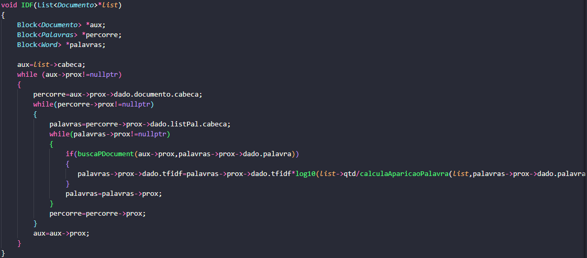 
		
 
		O método para percorrer as estruturas do IDF é o mesmo do TF, a mudança feita é na hora do cáculo que acontece no terceiro while. O cálculo do IDF é dado pela seguinte fórmula: 
		$$IDF=\log _{10}\left(\frac{número\:de\:documentos}{número\:de\:documentos\:em\:que\:a\:palavra\:aparece}\right)$$
	 	É feito um teste de condição antes do cálculo, ele chama a função <i>buscaPDocument(aux->prox,palavras->prox->dado.palavra)</i>, se ela retorna uma valor verdadeiro, é feita a conta do cálcula acima onde o número de documentos é representado por >i>list->qtd</i> e o número de documentos em que a palavra aparece é dado pela função <i>calcularAparicaoPalavra(list,palavras->prox->dado.palavra)</i>.
		Então, tiramos o logaritmo na base dez da divisão desses valores e multiplicamos pelo valor que já estava salvo na váriavel <i>palavras->prox->dado.tfidf</i> da palavra, que é o valor de <i>tf</i> qeu calculamos anteriormente. Assim, obtivemos o valor de <i>tfidf</i> que é salvo na variável <i>palavras->prox->dado.tfidf</i>.
		<h5>bool buscaPDocument(aux->prox,palavras->prox->dado.palavra)</h5>
		Retorna o valor da função <i>buscaLPTamanho(&doc->dado.documento,palavra)</i>
			 <h6>bool buscaLPTamnho(List<Palavras>*lista,std::string palavra)</h6>
	Nessa função, é criada um Bloco auxiliar de lista de palavras e uma variável <i>tam</i> que recebe o tamanho da palavra que veio para o método. Pegamos a cabeça da lista que recebemos e atribuímos à variável <i>aux</i>. Como a cabeça da lista está vazia, o while percorre a lista enquanto <i>aux->prox</i> tiver um valor válido (diferente de null). Então tem uma condição de que se <i>aux->prox->dado.listPal</i> for do tamanho da palavra, chamamos o método <i>pesquisaPalavra(&aux->prox->dado.listPal, palavra)</i>, isso evita que o algoritmo pesquise em todas as listas de tamanho do código para tentar achar a palavra desejada. Se esse método retornar true(que significa que há a palavra no documento, ele retorna true.
	

# Custo Computacional

Podemos analisar alguns custos computacionais a partir de certas variáveis:

<ul>
  <li>T -> Quantidade de documentos</li>
  <li>m -> Quantidade de linhas do documento</li>
  <li>ms -> Quantidade de linhas do documento de stopWords</li>
  <li>p -> Quantidade de palavras da linha</li>
  <li>c -> Quantidade de caracteres por palavra</li>
  <li>h -> Tamanho da lista de palavras por tamanho</li>
  <li>hs -> Tamanho da lista de stopWords por tamanho</li>
  <li>g -> Tamanho da lista de palavras</li>
  <li>gs -> Tamanho da lista de stopWords</li>
</ul>

<h4>Destes temos os seguintes custos médios de métodos mais relevantes:</h4>
<h5>Métodos de inserção:</h5>

$$preencheLista=T+T\left(mp\left(3+\left(\frac{3g}{4}+\frac{h}{2}+c\right)\right)+T\right)\qquad\qquad insertListaPalavra=\frac{3g}{4}+c\qquad\qquad insertLPTamanho=\frac{3g}{4}+\frac{h}{2}+c$$

<h5>Métodos de stopWords:</h5>

$$preencheListaStpw=(m_{s}+1)\left(\frac{3g}{4}+\frac{h}{2}+c\right)\qquad\qquad removeStopWords=h_{s}\*g_{s}\left(T\left(\frac{h}{2}+g\right)\right)$$

<h5>Métodos de TF-IDF:</h5>

$$TF=Thg+Thg(h+g)\qquad\qquad idf=Thg(h+g)\qquad\qquad CalculaAparicao=\left(\frac{h}{2}+\frac{g}{2}\right)$$

<h5>Métodos de ranqueamento:</h5>

$$ranking=T\left(\frac{h}{2}+\frac{g}{2}\right)+T^2$$

# Resultados

Para obtermos resultados de tempo na execução do nosso programa, fizemos testes em áreas separadas do programas, sendo elas:     
<ol>
  <li>Extração de palavras dos documentos base presentes em arquivos, inserção na fila e remoção das StopWords</li>
  <li>Cálculo do TD-IDF de cada palavra</li>
  <li>Ranqueamento das palavras baseado na frase "avanço tecnológico"</li>
</ol>    
A frase foi escolhida pois não está presente em todos os documentos e possui quantidade diversas.     

Os seguintes resultados de tempo foram obtidos:     

<table>
<thead>
  <tr>
    <th>Integrante&nbsp;&nbsp;&nbsp;1</th>
    <th>Integrante 2</th>
    <th>Integrante 3</th>
    <th>Integrante 4</th>
    <th>Integrante 5</th>
    <th>Integrante 6</th>
    <th></th>
  </tr>
</thead>
<tbody>
  <tr>
	  <td colspan="6">
Preenchimento de Listas e remoçao de Stopwords
</td>
    <td></td>
  </tr>
  <tr>
    <td>389</td>
    <td>261</td>
    <td>209</td>
    <td>275</td>
    <td>402</td>
    <td>371</td>
    <td></td>
  </tr>
  <tr>
    <td>381</td>
    <td>365</td>
    <td>204</td>
    <td>215</td>
    <td>354</td>
    <td>327</td>
    <td></td>
  </tr>
  <tr>
    <td>324</td>
    <td>371</td>
    <td>215</td>
    <td>239</td>
    <td>388</td>
    <td>404</td>
    <td></td>
  </tr>
  <tr>
    <td>275</td>
    <td>452</td>
    <td>202</td>
    <td>233</td>
    <td>376</td>
    <td>388</td>
    <td></td>
  </tr>
  <tr>
    <td>444</td>
    <td>362</td>
    <td>202</td>
    <td>209</td>
    <td>379</td>
    <td>345</td>
    <td>Média dos integrantes (ms):</td>
  </tr>
  <tr>
    <td>362,60</td>
    <td>362,20</td>
    <td>206,40</td>
    <td>234,20</td>
    <td>379,80</td>
    <td>367,00</td>
    <td>318,70</td>
  </tr>
  <tr>
    <td colspan="6">
Cálculo do TF-IDF
</td>
    <td></td>
  </tr>
  <tr>
    <td>9</td>
    <td>9</td>
    <td>12</td>
    <td>8</td>
    <td>16</td>
    <td>15</td>
    <td></td>
  </tr>
  <tr>
    <td>10</td>
    <td>10</td>
    <td>20</td>
    <td>8</td>
    <td>17</td>
    <td>15</td>
    <td></td>
  </tr>
  <tr>
    <td>12</td>
    <td>10</td>
    <td>14</td>
    <td>8</td>
    <td>16</td>
    <td>14</td>
    <td></td>
  </tr>
  <tr>
    <td>10</td>
    <td>10</td>
    <td>15</td>
    <td>8</td>
    <td>16</td>
    <td>14</td>
    <td></td>
  </tr>
  <tr>
    <td>12</td>
    <td>10</td>
    <td>14</td>
    <td>8</td>
    <td>17</td>
    <td>14</td>
    <td>Média dos integrantes (ms):</td>
  </tr>
  <tr>
    <td>10,60</td>
    <td>9,80</td>
    <td>15,00</td>
    <td>8,00</td>
    <td>16,40</td>
    <td>14,40</td>
    <td>12,37</td>
  </tr>
  <tr>
    <td colspan="6">
Ranqueamento baseado&nbsp;&nbsp;&nbsp;de frase "avanço tecnológico"
</td>
    <td></td>
  </tr>
  <tr>
    <td>0</td>
    <td>0</td>
    <td>0</td>
    <td>0</td>
    <td>0</td>
    <td>0</td>
    <td></td>
  </tr>
  <tr>
    <td>0</td>
    <td>0</td>
    <td>0</td>
    <td>0</td>
    <td>0</td>
    <td>0</td>
    <td></td>
  </tr>
  <tr>
    <td>0</td>
    <td>0</td>
    <td>0</td>
    <td>0</td>
    <td>0</td>
    <td>0</td>
    <td></td>
  </tr>
  <tr>
    <td>0</td>
    <td>0</td>
    <td>0</td>
    <td>0</td>
    <td>0</td>
    <td>0</td>
    <td></td>
  </tr>
  <tr>
    <td>0</td>
    <td>0</td>
    <td>0</td>
    <td>0</td>
    <td>0</td>
    <td>0</td>
    <td>Média dos integrantes (ms):</td>
  </tr>
  <tr>
    <td>0,00</td>
    <td>0,00</td>
    <td>0,00</td>
    <td>0,00</td>
    <td>0,00</td>
    <td>0,00</td>
    <td>0,00</td>
  </tr>
</tbody>
</table>

Esse resulado de tempo foi obtido retirando a média de cada participante, e a média total do grupo para cada parte. Essa média é importante para evitar bloqueios de hardware, fazendo com que a média seja independete do mesmo.

# Participantes

- Bárbara Braga Gualberto Correa 

- Gabriel Couto Assis 

- Gabriel Teixeira Júlio 

- Kemily Rezende Silva 

- Marcus Vinícius Nogueira Santos 

- Pablo Sousa da Silva 

- Thaissa Vitória Guimarães Daldegan de Sousa 

